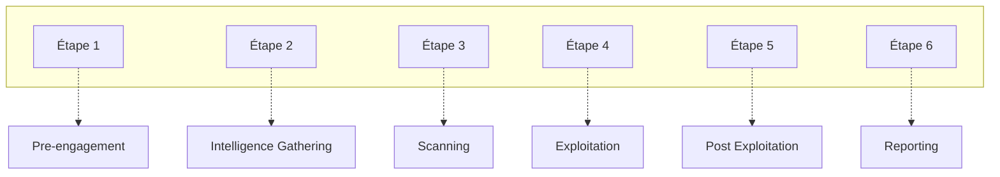

# Fenrir Pentest Methodology

In the field of cybersecurity, **_Penetration Tests_**, or **_Pentest_**, play a crucial role. They enable organizations to detect and correct vulnerabilities in their systems before they can be exploited by malicious attackers. An effective pentest mimics the actions of an external or internal attacker, seeking to access and exploit systems in a controlled manner to improve security. Although tools are used to perform these analyses, an excessive dependence on them can prove dangerous. 

>"_Tools are the subtlest of traps. We become reliant upon them and in their absence we are vulnerable, weak, defenseless._"

To counteract this counter-productivity, it is essential to follow a defined and structured methodology.

## The Phases of Pentest

The penetration test is carried out in six stages, each of which is important.

## Pre Engagement

Before the start of an audit, certain documentation must be completed during this phase to define the legal context and frame the audit. This involves creating a scoping document for the test, which includes the audit perimeter, duration, type of audit, mission order, audit authorization, the auditors' quotation, the non-disclosure agreement (NDA), etc.

### Checklist for Preparation
The comprehensive checklist before a pentest ensures that no critical element is overlooked. It covers technical aspects like the determination of pentest type, key objectives, and testing boundaries. It also includes administrative and logistic details such as contact information, the necessity of VPNs, web services used by the site, and specific client requirements. This checklist is crucial for preparing a pentest that is not only effective but also aligned with the client’s needs and legal requirements.
#### Hardware

##### Wi-Fi Adapter Supporting packet injection

> [wonderhowto](https://null-byte.wonderhowto.com/how-to/buy-best-wireless-network-adapter-for-wi-fi-hacking-2019-0178550/)

- TPLink Adapter

#### Software

##### Infrastructure

- VMware
- Virtualbox
- QEMU/KVM
    - Windows 10 VM
    - Kali/Blackarch/ParrotOS VM

#### Assessment

- Maltego - Maltego is an interactive data mining tool that renders directed graphs for link analysis.
- Metasploit Framework - collection of remote exploits and post exploitation tools for all platforms
- SET toolkit - designed to perform advanced attacks against the human element.
- theHarvester - gathering e-mail accounts, user names and hostnames/subdomains from different public sources
- mimikat - extract plain or hash of password.
- dig - bind-utils
- THC Hydra - for brute force
- Powersploit - a collection of Microsoft PowerShell modules
- CrackmapExec - post exploitation tools for Active Directory.
- Burpsuite - can use as proxy as well as active scanner
- Empire - powershell framework for remote and post exploitation.
- Nmap - port scanner
- knockpy - subdomain scanner
- netcat - network utility
- nishang - post exploitation powershell Framework
[See more  ](https://github.com/FenrirSec/fenrir-tools)

### Checklist

- [ ] Determination of the type of pentest (Blackbox, Whitebox)
- [ ] Key objectives behind this penetration test
- [ ] Location address and contact (if it is an onsite job)
- [ ] Validation that the Authorization Letter has been signed
- [ ] URL of the web application that is in scope and validation that isaccessible
        [Hurl](https://hurl.dev/ "https://hurl.dev/")
- [ ]  2 sets of credentials (normal and admin or a privilege user) and validation that are working
- [ ] Determination of the environment (Production or UAT)
- [ ] Number of static and dynamic pages
- [ ] Testing Boundaries (DoS, Brute force attacks etc.)
- [ ] Technologies (PHP, ASP, .NET, IIS, Apache, Operating system etc.)
- [ ] Any VPN or port numbers are needed and verify those ahead of time
- [ ] Any web services that the site may use.
- [ ] Any pages that the client does not want to be tested.
- [ ] Any pages that submit emails
- [ ] IP address of the tester
- [ ] Escalation contact
- [ ] 3rd parties that needs to be contacted in advance of the pentest
- [ ] Web application firewalls and other IDS in place
- [ ] Timeframe of the assessment (dates and hours)
- [ ] Diagrams and any kind of documentation
- [ ] Validation that a backup has been performed recently on theapplication
- [ ] Other client requirements

---

## Intelligence Gathering

In this phase, the pentest gathers as much information as possible about the target system. This includes domain registration details, IP addresses, and any public-facing information that can be leveraged in later stages. The goal is to map out the digital footprint of the target and identify potential entry points.

- whois enumeration
- [prips](https://manpages.ubuntu.com/manpages/focal/man1/prips.1.html) on Linux for IP range generation
- ip search on Bing (ip:{IP})
- Domain profiling
    - [robtex](https://www.robtex.com/dns-lookup/fenrir.pro)
    - [securitytrails](https://securitytrails.com/list/apex_domain/hack.courses)
    - [frbin](https://frbin.com/fenrir.pro)
- SubDomain Enumeration
    - Sublist3r
    - Amass
- [urlscan](https://urlscan.io/)
- Spidering + Local Copy
- 
Certificates transparency enumeration
     [securitytrails](https://securitytrails.com/list/apex_domain/fenrir.agency)
     [crt](https://crt.sh/ )
- WaybackMachine Archives
- Google -> [cache](https://fenrir.pro)
- Google -> [jobs](fenrir.pro)
- Emails : [hunter](hunter.io) (Have a look at the email sources also)
- HaveIBeenPwned -> Check breachcompilations
- [IntelX](https://intelx.io) (tous les outils necessaires)
- Visiting the website behing Tor/VPN
    - Wappalyzer
- Traffic Analysis
    - alexa
    - similarweb
    - semrush
- [osint](https://osint.link/)
- [shodan](shodan.io)
- [censys](censys.io)
- [kali](https://tools.kali.org/information-gathering/metagoofil)
- [public files](https://intelx.io/tools?tab=file), site:drive.google.com "target"
- Check Facebook, Twitter "target leaks" "target security" on Twitter
- [searchftps](https://www.searchftps.net/)
- [publicwww](https://publicwww.com/)
- [thingful](https://www.thingful.net)
- [grayhatwarfare](https://buckets.grayhatwarfare.com/)
- [wigle](wigle.net)
- [social-searcher](https://www.social-searcher.com/search-users/?ntw=&q6=lp1eu)
### Ressources 

- [osintframework](https://osintframework.com/)
- [Mail-Swipe](https://github.com/sameera-madushan/Mail-Swipe)
---

## Scanning

During the scanning phase, the pentester uses automated tools to identify open ports, active services, and vulnerabilities that could be exploited. This step is crucial for developing a detailed understanding of the target environment's security posture.

### Automatic Vuln scanners
- Accunetix
- OpenVas
- Vega
- Nikto
- Wikto
- w3af
- Xenotix XSS Framework
- Wapiti
- [HTTP](https://github.com/projectdiscovery/httpx)

### Manual Scanner
- nmap
- Metaploit Framework

### SSL scanners

- [testssh](testssh)
- sslscan
- [testssl](https://testssl.sh/ "https://testssl.sh/")

### Guides
- [revers3r](https://resources.infosecinstitute.com/author/revers3r/)

### Credential Spraying
- [Office 365](https://github.com/0xZDH/o365spra)
---

## Exploitation

This stage involves actively exploiting identified vulnerabilities to gain unauthorized access or escalate privileges within the system. The techniques used here mimic those that a real attacker might employ, providing a realistic assessment of the system’s defenses.

### AD exploitation

- [wadcoms](https://wadcoms.github.io/)
- [active-directory-methodolog](https://book.hacktricks.xyz/windows-hardening/active-directory-methodolog)
- [Methodology Windows](https://github.com/swisskyrepo/PayloadsAllTheThings/blob/master/Methodology%20and%20Resources/Windows%20-%20Privilege%20Escalation.md)
- [windows-hardening](https://book.hacktricks.xyz/windows-hardening/basic-cmd-for-pentesters#domain-info)

List of world-writables directories on Windows : [Lien](https://gist.github.com/mattifestation/5f9de750470c9e0e1f9c9c33f0ec3e56)

Write enumeration scripts with ADSI : [Lien](https://dev-2null.github.io/Easy-Domain-Enumeration-with-ADSI/)

### Windows Evasion

[herpaderping](https://jxy-s.github.io/herpaderping/)

### Initial Intrusion

- [exploit-db](https://www.exploit-db.com/)
- [CyberChef](https://gchq.github.io/CyberChef/)
- [Reverse-shell-Cheat-Sheet](http://blog.safebuff.com/2016/06/19/Reverse-shell-Cheat-Sheet/)
- [hacktricks](https://book.hacktricks.xyz/)
- [NTLMRawUnhide](https://github.com/mlgualtieri/NTLMRawUnhide)
- [Password Dictionaries Generation](https://github.com/r3nt0n/bopscrk )
- [[Assetnote Wordlists](https://wordlists.assetnote.io/)
- CewL

## Wapp/API Testing

- Account creation
- Account activation
- [Login]( https://www.kitploit.com/2020/10/jwt-hack-tool-to-endecoding-jwt.html)
- Account modification
- Phone number verification
- Password reset
- [Automating xss](https://medium.com/@parasarora06/automating-xss-identification-with-dalfox-paramspider-e14283bb7916)
- [Parameters enumeration for API routes](https://github.com/s0md3v/Arjun)

## WiFI

- [pass-the-hash-wifi](https://sensepost.com/blog/2020/pass-the-hash-wifi/)

---

## Post Exploitation

Once access is gained, this phase aims to determine the potential damage and data exposure that could occur. It involves exploring the compromised system to understand the depth of access obtained, extracting sensitive data, and assessing the possibility of maintaining long-term access for further exploitation.

### Windows

=======
[PowerShell Commands for Pentesters](https://www.infosecmatter.com/powershell-commands-for-pentesters/)
- Windows sysinternals `net use Z: https://live.sysinternals.com`

#### Password dumping
- Pwdump7
- TBAL DPAIP Backdoor for local user
- Dumping Domain Password
- Dumping ClearText Creds
- Empire Tips and Trick
- Extract Remote Hash
- Capturing NetNTML
#### AD
- The worst of both worlds
- pass-the-hash-is-dead-long-live-localaccounttokenfilterpolicy
- Beyond LLMNR/NBNS Spoofing
- Gathering AD Data with Powershell
- kerberosting without mimikatz
- Kerberost
- Golden Ticket
- pass-the-ticket
- Gaining Domain Admin Rights
- Attacking Kerberos : kicking the guard dog of hades
- Token Impersonation

#### Privilege Escalation
- [PEASS - Privilege Escalation Awesome Scripts SUITE](https://github.com/carlospolop/privilege-escalation-awesome-scripts-suite)
- Windows Privilege Escalation Fundamentals by FuzzySecurity
- DLL Hijacking
- Potato
- RottenPotatoNG
- Privilege Escalation Guide
- Lateral Movement
- RDP tunneling
- SQL Server Link Crawling
- Lateral Movement WinRM
- CrackeMapExec
- RDP Inception
- RDP Lateral Movement
- Powerview and crackmapExec
- Persistent payload
- port forwarding with netsh
- The Trustpocalypse
- DcShadow Explained
- Domain Trust: Why You Should Care
- A Guide to Attacking Domain Trusts
- Javascript C2

#### Bypass techniques
- evading autorun
- mimikatz obfuscation
- Putting data in Alternate data streams and how to execute it
- Leveraging INF-SCT Fetch
- Empire without powershell
- Powershell without powershell
- Exploitation Code Injection 
- Powershell to bypass Constraint mode
- Bypass Constraint Mode with runscripthelper
- InternetExplorer.Application for C2
- We Don't Need Powershell.exe Part 2
- WSH Injection

#### MISC
- Borrowing Microsoft Code Signing Certificates
- Guide to Attacking Domain Trust

### Linux
#### Privilege Escalation
- Basic Linux Privilge escalation by g0tmi1k
- Exploit Database
- Attack and Defend : Linux Privilege Escalation
- SUID executable
- Guide to Linux Privilege Escaltion
- LDAP
- Understand and Exploit web based LDAP
- Web based LDAP injection
- Lateral Movement
- SSH port forwarding
- SSH & meterpreter port forward
- Tunneling & port forwarding
#### Web Shell
- webshell
- p0wny

#### Data Exfil
- awesome-red-teaming
- out of band Exploitation

## Reporting

The final phase of the pentest involves compiling all findings, methodologies, and evidence into a comprehensive report. This report is crucial for the client as it provides detailed insights into the vulnerabilities identified, the methods used by the pentesters, and concrete recommendations for enhancing system security.

### Deliverable

At the end of the mission, a comprehensive deliverable will be provided, encapsulating all aspects of the audit performed. This structured document will allow for a clear understanding of the vulnerabilities discovered as well as recommendations for remediation.

#### Contents of the Deliverable

-   **Notes Document**: A  `notes.md`  file, formatted in Markdown according to GitHub's formatting guidelines, detailing each audit phase with the information discovered and its sources.
-   **Screenshot Folder**: Includes all screenshots from tests conducted, even those that did not result in vulnerabilities.
-   **Scripts Folder**: Contains all scripts and payloads used during the pentest, including offensive scripts developed for the audit.
-   **Tool Outputs Folder**: Gathers output files from various scanning tools and scripts used, providing a technical overview of the tests conducted.

#### Format and Security

The deliverable will be prepared as an archive, preferably in 7zip format, with strong encryption using AES-256 or AES-512. It will be structured in clearly named folders for easy navigation and stored either as an encrypted archive or on a secure, private online sharing space.

#### Deliverable Structure

-   `notes.md`: The main document containing all detailed notes from the audit.
-   `screenshots/`: Folder containing the screenshots.
-   `scripts/`: Folder containing the scripts used.
-   `scripts_output/`: Folder containing the outputs of tools.

This reporting structure not only highlights the vulnerabilities and actions taken but also ensures traceability and clarity in the audit processes for future audits or compliance checks.

---
- [Writing-penetration-testing-report](https://www.sans.org/reading-room/whitepapers/bestprac/writing-penetration-testing-report-33343)
- [Public-pentesting-reports](https://github.com/juliocesarfort/public-pentesting-reports)
- [Kali-reporting-tools](https://resources.infosecinstitute.com/kali-reporting-tools/#gref)
- [Typst](https://typst.app/ "https://typst.app/")
---

## Ressources

- [Pentest-methodology](https://github.com/kyawthiha7/pentest-methodology)
- [Pre-engagement](http://www.pentest-standard.org/index.php/Pre-engagement)
- [Penetration_testing_methodologies](https://www.owasp.org/index.php/Penetration_testing_methodologies)
- [Penetration-testing-methodologies-and-standards](https://resources.infosecinstitute.com/penetration-testing-methodologies-and-standards/)
- [Penetration-testing-methodology](https://www.pentestpeople.com/penetration-testing-methodology/)

